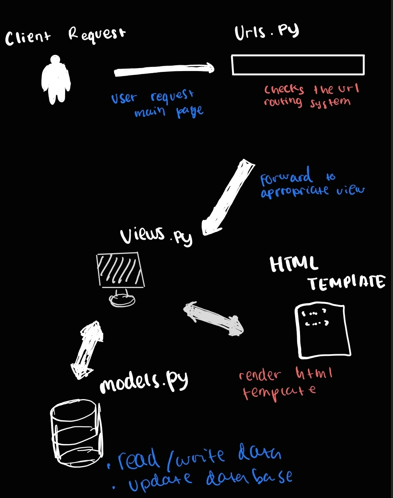

🐐 KambingKu - E-commerce Jual Beli Kambing 🐐

Selamat datang di KambingKu, tempat di mana kambing-kambing terbaik di Indonesia berkumpul untuk dijual (dan dibeli, tentu saja). Dari kambing sehat, gemuk, lucu, sampai kambing yang pandai selfie — semua ada di sini!

Ini adalah langkah besar untuk dunia per-kambing-an digital! 🚀

Apa itu KambingKu? 🤔
KambingKu adalah platform e-commerce khusus untuk kambing. Ya, benar sekali! Di sini, kamu bisa menemukan berbagai jenis kambing dari seluruh pelosok nusantara. Baik untuk kurban, ternak, atau sekadar ingin pelihara kambing imut, KambingKu adalah tempat yang tepat!

Apakah kamu sedang mencari kambing yang bisa merumput sendiri? Atau kambing yang hobi jogging? Kami punya semuanya. Di KambingKu, setiap kambing punya cerita, dan kami yakin ada satu kambing yang pas untukmu. 😉

Note Terakhir:
Di KambingKu, setiap kambing adalah spesial. Jadi ingat, kambing juga butuh cinta, perhatian, dan rumput berkualitas!

Happy shopping! 🛒🎉 :

1. Membuat Proyek Django Baru:

- Buat direktori dengan nama kambing-ku.

- Buat virtual environment dengan menjalankan python -m venv env di dalam direktori kambing-ku.

- Aktifkan virtual environment tersebut, kemudian jalankan django-admin startproject kambing-ku untuk memulai proyek Django.

- Pindah ke direktori proyek yang baru dibuat: cd kambing-ku.

2. Membuat Main dan Mengatur Routing:

- Di dalam direktori kambing-ku, buat file baru dengan nama main menggunakan perintah python manage.py startapp main.

- Tambahkan 'main' ke dalam daftar INSTALLED_APPS di berkas settings.py.

- Pada berkas urls.py proyek, tambahkan routing untuk menghubungkan urls.py dari main.

3. Membuat Model Product:

Di dalam berkas main/models.py, buat model Product dengan atribut name, price, dan description seperti berikut:

class Product(models.Model):
    name = models.CharField(max_length=100)
    price = models.IntegerField()
    description = models.TextField()

Jalankan perintah python manage.py makemigrations dan python manage.py migrate untuk memigrasi model ke database.

4. Membuat Fungsi pada views.py:

Di dalam main/views.py, buat fungsi yang mengembalikan template HTML:

5. Membuat Template HTML:

Di dalam direktori main, buat folder templates, dan di dalamnya buat berkas HTML dengan nama main.html.

6. Mengatur Routing di urls.py:

- Di dalam berkas main/urls.py, petakan fungsi dari views.py

- Di berkas urls.py proyek, tambahkan routing untuk menghubungkan main

7. Melakukan Deployment ke PWS:

- Masuk ke halaman PWS dan buat proyek baru dengan nama kambing-ku.

- Tambahkan URL PWS ke daftar ALLOWED_HOSTS di settings.py.

- Jalankan perintah deployment dari PWS, dan gunakan perintah git push pws main:master untuk perubahan selanjutnya.

Fungsi Git Dalam Pengembangan Perangkat Lunak

Git sangat membantu dalam proyek besar dan kolaborasi antara beberapa pengembang yang bekerja pada proyek yang sama secara bersamaan. Dengan Git, kita bisa menggunakan git branch untuk membuat fitur yang berbeda, kemudian kita gabungkan kembali ke proyek utama. Kita juga bisa menggunakan git clone untuk mengerjakan proyek tanpa koneksi internet. Selain itu, karena kita melakukan git push ke dalam repositori, kita tidak perlu khawatir kehilangan kode karena kita selalu memiliki cadangan di repositori GitHub kita. Terakhir, Git memungkinkan kolaborator untuk meninjau kode melalui git pull requests sebelum kode tersebut digabungkan, memastikan kualitas yang lebih baik.

Framework Django Sebagai Permulaan Pembelajaran Pengembangan Perangkat Lunak

Menurut saya, framework Django dipilih sebagai permulaan pembelajaran pengembangan perangkat lunak karena kemudahan penggunaannya.

Django dibangun di atas Python, salah satu bahasa pemrograman yang paling mudah dipahami, terutama bagi pemula. Python memiliki sintaks yang sederhana, dan Django memanfaatkan keunggulan ini dengan menawarkan kemudahan dalam pengaturan awal. Hal ini memungkinkan pengembang untuk segera fokus pada pengembangan fitur aplikasi tanpa harus melakukan konfigurasi teknis yang rumit. Dengan Django, pemula dapat lebih cepat memahami konsep dasar pengembangan web dan langsung menerapkannya dalam proyek nyata.