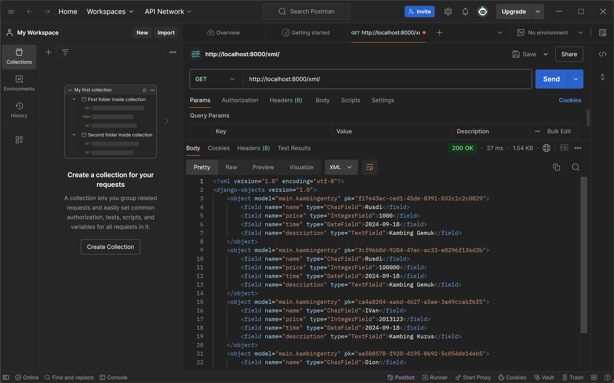
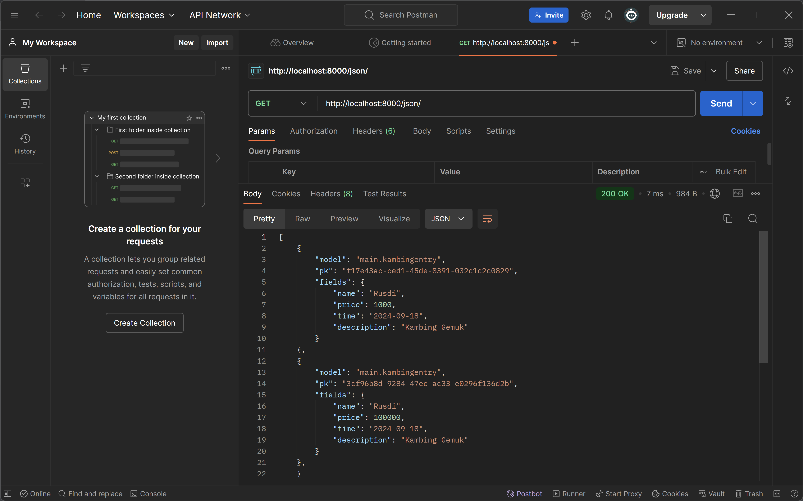
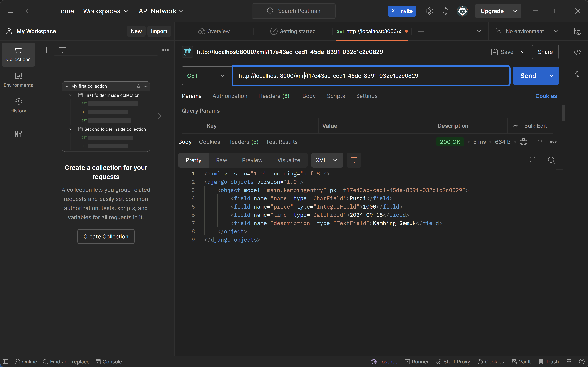
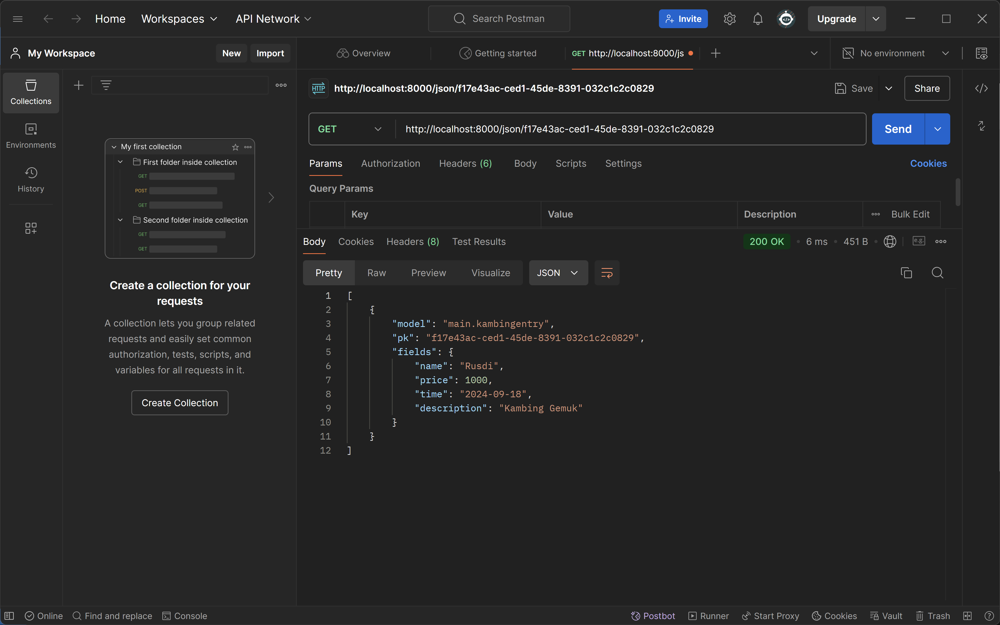
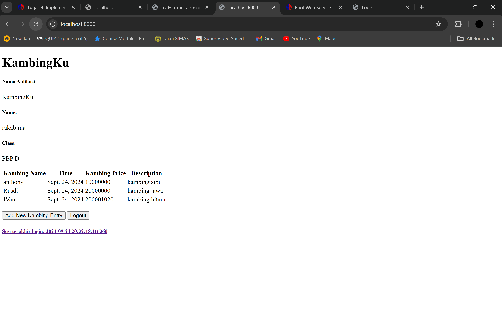
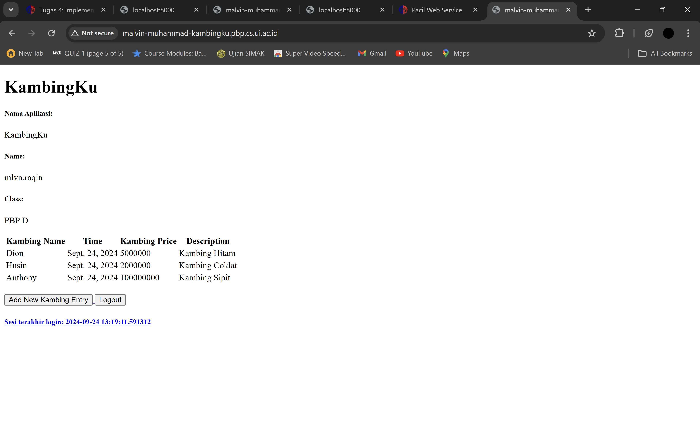

🐐 KambingKu - E-commerce Jual Beli Kambing 🐐
http://malvin-muhammad-kambingku.pbp.cs.ui.ac.id/
Selamat datang di KambingKu, tempat di mana kambing-kambing terbaik di Indonesia berkumpul untuk dijual (dan dibeli, tentu saja). Dari kambing sehat, gemuk, lucu, sampai kambing yang pandai selfie — semua ada di sini!

Ini adalah langkah besar untuk dunia per-kambing-an digital! 🚀

Apa itu KambingKu? 🤔
KambingKu adalah platform e-commerce khusus untuk kambing. Ya, benar sekali! Di sini, kamu bisa menemukan berbagai jenis kambing dari seluruh pelosok nusantara. Baik untuk kurban, ternak, atau sekadar ingin pelihara kambing imut, KambingKu adalah tempat yang tepat!

Apakah kamu sedang mencari kambing yang bisa merumput sendiri? Atau kambing yang hobi jogging? Kami punya semuanya. Di KambingKu, setiap kambing punya cerita, dan kami yakin ada satu kambing yang pas untukmu. 😉


Note Terakhir:
Di KambingKu, setiap kambing adalah spesial. Jadi ingat, kambing juga butuh cinta, perhatian, dan rumput berkualitas!

Happy shopping! 🛒🎉 :

1. Membuat Proyek Django Baru:

- Buat direktori dengan nama kambing-ku.

- Buat virtual environment dengan menjalankan python -m venv env di dalam direktori kambing-ku.

- Aktifkan virtual environment tersebut, kemudian jalankan django-admin startproject kambing-ku untuk memulai proyek Django.

- Pindah ke direktori proyek yang baru dibuat: cd kambing-ku.

2. Membuat Main dan Mengatur Routing:

- Di dalam direktori kambing-ku, buat file baru dengan nama main menggunakan perintah python manage.py startapp main.

- Tambahkan 'main' ke dalam daftar INSTALLED_APPS di berkas settings.py.

- Pada berkas urls.py proyek, tambahkan routing untuk menghubungkan urls.py dari main.

3. Membuat Model Kambing:

Di dalam berkas main/models.py, buat model Kambing dengan atribut name, price, dan description seperti berikut:

class Kambing(models.Model):
    name = models.CharField(max_length=100)
    price = models.IntegerField()
    description = models.TextField()

Jalankan perintah python manage.py makemigrations dan python manage.py migrate untuk memigrasi model ke database.

4. Membuat Fungsi pada views.py:

Di dalam main/views.py, buat fungsi yang mengembalikan template HTML:


5. Membuat Template HTML:

Di dalam direktori main, buat folder templates, dan di dalamnya buat berkas HTML dengan nama main.html.


6. Mengatur Routing di urls.py:

- Di dalam berkas main/urls.py, petakan fungsi dari views.py

- Di berkas urls.py proyek, tambahkan routing untuk menghubungkan main


7. Melakukan Deployment ke PWS:

- Masuk ke halaman PWS dan buat proyek baru dengan nama kambing-ku.

- Tambahkan URL PWS ke daftar ALLOWED_HOSTS di settings.py.

- Jalankan perintah deployment dari PWS, dan gunakan perintah git push pws main:master untuk perubahan selanjutnya.


Fungsi Git Dalam Pengembangan Perangkat Lunak

Git sangat membantu dalam proyek besar dan kolaborasi antara beberapa pengembang yang bekerja pada proyek yang sama secara bersamaan. Dengan Git, kita bisa menggunakan git branch untuk membuat fitur yang berbeda, kemudian kita gabungkan kembali ke proyek utama. Kita juga bisa menggunakan git clone untuk mengerjakan proyek tanpa koneksi internet. Selain itu, karena kita melakukan git push ke dalam repositori, kita tidak perlu khawatir kehilangan kode karena kita selalu memiliki cadangan di repositori GitHub kita. Terakhir, Git memungkinkan kolaborator untuk meninjau kode melalui git pull requests sebelum kode tersebut digabungkan, memastikan kualitas yang lebih baik.


Framework Django Sebagai Permulaan Pembelajaran Pengembangan Perangkat Lunak

Menurut saya, framework Django dipilih sebagai permulaan pembelajaran pengembangan perangkat lunak karena kemudahan penggunaannya.

Django dibangun di atas Python, salah satu bahasa pemrograman yang paling mudah dipahami, terutama bagi pemula. Python memiliki sintaks yang sederhana, dan Django memanfaatkan keunggulan ini dengan menawarkan kemudahan dalam pengaturan awal. Hal ini memungkinkan pengembang untuk segera fokus pada pengembangan fitur aplikasi tanpa harus melakukan konfigurasi teknis yang rumit. Dengan Django, pemula dapat lebih cepat memahami konsep dasar pengembangan web dan langsung menerapkannya dalam proyek nyata.


Mengapa kita perlu pengiriman data dalam membuat sebuah platform

Alasan utama kita butuh pengiriman data dalam membuat sebuah platform adalah untuk memastikan semua proses berjalan berdasarkan data. Platform perlu berinteraksi dengan berbagai bagian seperti basis data, pengguna, dan elemen lainnya (seperti yang digambarkan di Tugas Individu 2). Agar interaksi ini berhasil, data harus bisa dipindahkan atau dikirim antar bagian sistem. Dengan adanya pengiriman data, kita bisa memastikan:

- Permintaan pengguna seperti mengisi formulir ditangani dengan benar
- Data di berbagai bagian sistem tetap sinkron atau terhubung dengan baik
- Laporan atau data yang diambil dari basis data bisa berjalan dengan lancar

Mana yang lebih baik, XML atau JSON? Mengapa JSON lebih populer?

Menurut saya, JSON lebih baik karena saat kita melihat respons Postman dari URL yang diambil, JSON lebih sederhana dan mudah dibaca dibandingkan XML. Alasan mengapa JSON lebih populer adalah karena kesederhanaannya, yang sangat penting terutama dalam pengembangan web ketika harus menangani banyak data.

Fungsi dari metode is_valid() di form Django

Di Django, metode **is_valid()** digunakan untuk memeriksa apakah data yang dimasukkan ke dalam form sudah sesuai dengan aturan yang ditentukan dan untuk memastikan tidak ada kesalahan. Dengan menggunakan **is_valid()**, kita bisa memastikan bahwa:

- Semua kolom yang harus diisi di form sudah terisi
- Tipe data yang dimasukkan sesuai dengan tipe data yang diharapkan
- Jika data valid, **is_valid()** akan mengembalikan nilai *True*, yang berarti data tersebut bisa diproses lebih lanjut (misalnya, disimpan ke dalam basis data). Jika tidak valid, akan mengembalikan *False*, dan biasanya kesalahan akan ditampilkan kepada pengguna.

Metode ini penting untuk mencegah data yang salah atau tidak sesuai diproses, sehingga menjaga keamanan dan integritas aplikasi.

Mengapa kita perlu csrf_token di form Django

Django menggunakan **csrf_token** (Cross-Site Request Forgery token) untuk melindungi form dari serangan CSRF. Serangan CSRF terjadi ketika ada situs jahat yang menipu pengguna untuk mengirim permintaan ke situs lain di mana mereka sudah login. Jika tidak ada **csrf_token**:

- Penyerang bisa melakukan tindakan yang tidak sah, seperti mengirim form atas nama pengguna tanpa sepengetahuannya
- Data dan keamanan sistem bisa terganggu, bahkan bisa menyebabkan pencurian data atau peretasan
- Tanpa **csrf_token**, semua ini lebih mudah dimanfaatkan oleh penyerang. **Csrf_token** memastikan bahwa permintaan form benar-benar datang dari pengguna yang sudah terverifikasi, dengan membuat token unik yang diverifikasi baik di sisi pengguna maupun server.

Implement Checklist Step by Step

1. Buatlah file bernama forms.py di direktori main dengan isi sebagai berikut:

from django.forms import ModelForm
from main.models import KambingEntry

class KambingEntryForm(ModelForm):
    class Meta:
        model = KambingEntry
        fields = ["name", "price", "description"]

2. Buka file views.py di direktori main.
   Tambahkan import statement berikut di bagian paling atas file:

   from django.shortcuts import render, redirect
   from main.forms import KambingEntryForm
   from main.models import KambingEntry

3. Buat fungsi untuk menambahkan entri ke database di dalam file    views.py di direktori main dengan isi sebagai berikut:
 
def create_kambing_entry(request):
    form = KambingEntryForm(request.POST or None)
    

    if form.is_valid() and request.method == "POST":
        form.save()
        return redirect('main:show_main')

    context = {'form': form}
    return render(request, "create_kambing_entry.html", context)

4. Ubah fungsi show_main di dalam file views.py untuk menangani kambing sebagai berikut:

def show_main(request):
    kambing_entries = KambingEntry.objects.all()

    context = {
        'Nama_Aplikasi': 'KambingKu',
        'Name': 'Malvin Muhammad Raqin',
        'Class': 'PBP D',
        'kambing_entries': kambing_entries
    }

    return render(request, "main.html", context)

5. Buat direktori bernama templates di dalam direktori main dan buat file HTML dengan nama base.html yang berfungsi sebagai kerangka untuk tampilan. Isi file tersebut dengan:


<!DOCTYPE html>
<html lang="en">
  <head>
    <meta charset="UTF-8" />
    <meta name="viewport" content="width=device-width, initial-scale=1.0" />
     
  </head>

  <body>
     
  </body>
</html>

6. Tambahkan folder templates dengan mengedit file settings.py di direktori proyek, misalnya KambingKu, seperti berikut:

... 

        'BACKEND': 'django.template.backends.django.DjangoTemplates',
        'DIRS': [BASE_DIR / 'templates'],
...

7. Mengimplementasikan basis data ke halaman utama `main.html` sehingga menggunakan `base.html` sebagai template utama dan juga memperluas `base.html` di dalam direktori `main`.



<h1>KambingKu</h1>
<h5>Nama Aplikasi: </h5>
<p>{{ Nama_Aplikasi }}<p>
<h5>Name: </h5>
<p>{{ Name }}<p>
<h5>Class: </h5>
<p>{{ Class }}<p>
    
    <p>Belum ada data kambing pada KambingKu.</p>
    
    <table>
      <tr>
        <th>Kambing Name</th>
        <th>Time</th>
        <th>Kambing Price</th>
        <th>Description</th>
      </tr>
    
       Berikut cara memperlihatkan data kambing di bawah baris ini 
       
      
      <tr>
        <td>{{kambing_entry.name}}</td>
        <td>{{kambing_entry.time}}</td>
        <td>{{kambing_entry.price}}</td>
        <td>{{kambing_entry.description}}</td>
      </tr>
      
    </table>
    
    
    <br />
    
    <a href="">
      <button>Add New Kambing Entry</button>
    </a>


Karena kita ingin menampilkan data berdasarkan ID, kita perlu mengubah primary key menjadi UUID untuk membuat aplikasi kita lebih aman. Berikut caranya:

1. Pada file models.py di direktori main, tambahkan baris-baris berikut :

import uuid # add this at the top (import statements)
...
class ...
    id = models.UUIDField(primary_key=True, default=uuid.uuid4, editable=False)
    ...

2. Tambahkan impor berikut ke file views.py di direktori main pada bagian atas file:

from django.http import HttpResponse
from django.core import serializers

3. Berikut adalah cara untuk membuat fungsi di dalam views.py di direktori main agar dapat menampilkan data dalam format JSON dan XML, baik secara keseluruhan maupun berdasarkan ID dari setiap entri basis data:

def show_xml(request):
    data = KambingEntry.objects.all()
    return HttpResponse(serializers.serialize("xml", data), content_type="application/xml")

def show_json(request):
    data = KambingEntry.objects.all()
    return HttpResponse(serializers.serialize("json", data), content_type="application/json")


def show_xml_by_id(request, id):
    data = KambingEntry.objects.filter(pk=id)
    return HttpResponse(serializers.serialize("xml", data), content_type="application/xml")

def show_json_by_id(request, id):
    data = KambingEntry.objects.filter(pk=id)
    return HttpResponse(serializers.serialize("json", data), content_type="application/json")

Buat routing URL untuk semua fungsi di dalam views.py

Impor semua fungsi yang telah kita buat di views.py ke dalam file urls.py di direktori main pada bagian atas file sebagai berikut:

from main.views import show_main, create_kambing_entry, show_xml  show_json, show_xml_by_id, show_json_by_id

Di dalam file urls.py di direktori main, tambahkan semua URL yang sesuai dari modifikasi yang telah kita buat di views.py sebagai berikut:

...
urlpatterns = [
    path('', show_main, name='show_main'),
    path('create-kambing-entry', create_kambing_entry, name='create_kambing_entry'),
    path('xml/', show_xml, name='show_xml'),
    path('json/', show_json, name='show_json'),
    path('xml/<str:id>/', show_xml_by_id, name='show_xml_by_id'),
    path('json/<str:id>/', show_json_by_id, name='show_json_by_id'),
]
...

Untuk menguji aplikasi di localhost, Anda bisa menjalankan perintah berikut di terminal:

python manage.py runserver

lalu buka http://localhost:8000/ di browser anda


Screenshot Postman

1. XML



2. JSON



3. XML by id



4. JSON by id



.

    ## Tugas Individiual 4

1. **Apa perbedaan antara `HttpResponseRedirect()` dan `redirect()`?**

    Kedua fungsi ini digunakan untuk melakukan pengalihan (redirection), tetapi perbedaannya adalah `HttpResponseRedirect` memerlukan URL secara eksplisit atau menggunakan `reverse()` untuk mencari URL, sedangkan `redirect` adalah shortcut yang lebih mudah karena bisa secara otomatis menghubungkan URL dari nama view atau objek model, seperti yang kita lakukan di fungsi `logout_user`.

2. **Bagaimana model `KambingEntry` dihubungkan dengan `User`?**

    Sama seperti implementasi di atas, kita bisa menghubungkan model dengan menggunakan hubungan `ForeignKey`. Hal ini memungkinkan satu pengguna memiliki banyak entri kambing, tetapi setiap entri hanya terkait dengan satu pengguna, yaitu hubungan One-To-Many.

3. **Perbedaan antara *authentication* dan *authorization*, serta apa yang terjadi saat pengguna login? Jelaskan bagaimana Django mengimplementasikan kedua konsep ini.**

    *Authentication* adalah proses untuk memverifikasi identitas pengguna (misalnya, memeriksa username dan password). Django mengelola ini menggunakan fungsi seperti `authenticate()` dan `login()`:
    ```bash
    from django.contrib.auth import authenticate, login

    def user_login(request):
        user = authenticate(username='john', password='secret')
        if user is not None:
            login(request, user)
    ```

    *Authorization* adalah proses untuk menentukan tindakan apa yang diizinkan dilakukan oleh pengguna yang telah diautentikasi. Django menggunakan decorator seperti `@login_required` dan `@permission_required` untuk mengelola otorisasi:
    ```bash
    from django.contrib.auth.decorators import login_required

    @login_required
    def my_view(request):
        ...
    ```

    Saat pengguna login, Django melakukan hal berikut:

    - **Autentikasi**: Memeriksa kredensial pengguna (dengan `authenticate()`).
    - **Membuat sesi**: Setelah berhasil, Django membuat sesi dan menyimpan ID sesi di cookies.
    - **Mengasosiasikan sesi**: Django melacak status autentikasi pengguna menggunakan sesi ini.

4. **Bagaimana Django mengingat pengguna yang sudah login? Jelaskan penggunaan lain dari *cookies* dan apakah semua cookies aman digunakan.**

    Django menggunakan **session** dan **cookies** untuk mengingat pengguna yang sudah login:

    - **Sessions**: Django menyimpan data sesi di sisi server dan mengaitkannya dengan ID sesi unik yang dikirim ke browser pengguna sebagai cookie.
    - **Cookies**: Cookie adalah file kecil yang disimpan di sisi klien. ID sesi disimpan dalam cookie (biasanya bernama `sessionid`), yang dikirim dengan setiap permintaan berikutnya.

    Penggunaan lain dari cookies:

    - **Menyimpan preferensi**: Cookies bisa digunakan untuk menyimpan preferensi pengguna, seperti pengaturan bahasa.
    - **Melacak aktivitas**: Cookies dapat digunakan untuk melacak perilaku pengguna untuk analitik atau personalisasi.
    - **Mengingat input form**: Cookies dapat menyimpan nilai input form yang pernah dimasukkan sebelumnya.

    Apakah semua cookies aman?
    Tidak semua cookies aman. Beberapa pertimbangan keamanan:

    - **Secure flag**: Cookies dengan flag "Secure" hanya dikirim melalui HTTPS, membuatnya lebih aman.
    - **HttpOnly flag**: Cookies dengan flag "HttpOnly" tidak bisa diakses oleh JavaScript di sisi klien, mencegah serangan XSS.
    - **Session Hijacking**: Jika cookie sesi disadap, penyerang dapat menyamar sebagai pengguna.

5.  **Bagaimana cara mengimplementasikan checklist di atas langkah demi langkah?**

#### Implementasi Fungsi Register, Login, dan Logout

##### **Register**

1. Untuk mengimplementasikan fungsi register, kita bisa menggunakan fungsi bawaan `UserCreationForm` dari Django. Tambahkan import berikut di `views.py` dalam direktori `main` sebagai berikut:
    ```bash
    ...
    from django.contrib.auth.forms import UserCreationForm
    from django.contrib import messages
    ```

2. Kita bisa mengimplementasikan fungsi register dan menambahkannya ke `views.py` sebagai berikut:
    ```bash
    def register(request):
        form = UserCreationForm()
    
        if request.method == "POST":
            form = UserCreationForm(request.POST)
            if form.is_valid():
                form.save()
                messages.success(request, 'Akun baru Anda berhasil ditambahkan!')
                return redirect('main:login')
        context = {
            'form':form
            }
        return render(request, 'register.html', context)
    ```
    Seperti yang dapat dilihat, akun akan dibuat jika `is_valid()` mengembalikan nilai True. Setelah itu, akan diarahkan kembali ke halaman login.

3. Buat file HTML baru bernama `register.html` di dalam subdirektori `templates` di direktori `main` sebagai berikut:
    ```bash
    

    
    <title>Register</title>
    

    

    <div class="login">
    <h1>Register</h1>

    <form method="POST">
        
        <table>
        {{ form.as_table }}
        <tr>
            <td></td>
            <td><input type="submit" name="submit" value="Register" /></td>
        </tr>
        </table>
    </form>

    
    <ul>
        
        <li>{{ message }}</li>
        
    </ul>
    
    </div>

    
    ```

4. Jangan lupa untuk mengimplementasikannya ke dalam `urlpatters` agar fungsi dapat diakses. Pada `urls.py` di direktori `main`, impor fungsi sebagai berikut:
    ```bash
    from main.views import ..., register
    ```

    Tambahkan path URL:
    ```bash
    urlpatterns = [
        ...
        path('register/', register, name='register')
        ]
    ```

##### **Login**

5. Untuk mengimplementasikan fungsi login, kita bisa menggunakan fungsi bawaan `authenticate`, `login`, dan `AuthenticationForm` dari Django. Tambahkan import berikut di `views.py` dalam direktori `main` sebagai berikut:
    ```bash
    ...
    from django.contrib.auth.forms import ..., AuthenticationForm
    from django.contrib.auth import authenticate, login
    ```

6. Kita bisa mengimplementasikan fungsi login dan menambahkannya ke `views.py` sebagai berikut:
    ```bash
    def login_user(request):
        if request.method == 'POST':
            form = AuthenticationForm(data=request.POST)
    
            if form.is_valid():
                user = form.get_user()
                login(request, user)
                response = HttpResponseRedirect(reverse("main:show_main"))
                response.set_cookie('last_login', str(datetime.datetime.now()))
                return response
    
        else:
            form = AuthenticationForm(request)
        context = {'form': form}
        return render(request, 'login.html', context)
    ```

7. Buat file HTML baru bernama `login.html` untuk menampilkan fungsi login di dalam subdirektori `templates` di direktori `main` sebagai berikut:
    ```bash
    

    
    <title>Login</title>
    

    
    <div class="login">
    <h1>Login</h1>

    <form method="POST" action="">
        
        <table>
        {{ form.as_table }}
        <tr>
            <td></td>
            <td><input class="btn login_btn" type="submit" value="Login" /></td>
        </tr>
        </table>
    </form>

    
    <ul>
        
        <li>{{ message }}</li>
        
    </ul>
     Belum punya akun?
    <a href="">Daftar Sekarang</a>
    </div>

    
    ```

8. Tambahkan fungsi ke `urls.py` untuk mengakses login. Pada `urls.py` di direktori `main`, impor fungsi sebagai berikut:
    ```bash
    from main.views import ..., login_user
    ```

    Tambahkan path URL:
    ```bash
    urlpatterns = [
        ...
        path('login/', login_user, name='login')
        ]
    ```

##### **Logout**

9. Untuk mengimplementasikan fungsi logout, kita bisa menggunakan fungsi bawaan `logout` dari Django. Tambahkan import ini di `views.py` di direktori `main`:
    ```bash
    ...
    from django.contrib.auth import ..., logout
    ```

10. Kita bisa mengimplementasikan fungsi logout dan menambahkannya ke `views.py` sebagai berikut:
    ```bash
    def logout_user(request):
        logout(request)
        return redirect('main:login')
    ```

11. Tambahkan tombol logout ke `main.html` untuk mengarahkan pengguna ke logout. Tambahkan kode berikut di subdirektori `templates` di direktori `main`:
    ```bash
    ...
    <a href="">
        <button>Logout</button>
    </a>
    ```

12. Tambahkan path ke `urls.py` untuk logout. Pada `urls.py` di direktori `main`, impor fungsi sebagai berikut:
    
    ```bash
    from main.views import ..., logout_user
    ```

    Tambahkan path URL:
    ```bash
    urlpatterns = [
        ...
        path('logout/', logout_user, name='logout')
        ]
    ```

    Sekarang semua fungsi Register, Login, dan Logout sudah diimplementasikan.

#### Menampilkan Detail Pengguna yang Login (Username) dan Menggunakan Cookies (Last Login)

##### **Implementasi Cookies**

1. Untuk mengimplementasikan `last_login`, kita butuh waktu dan tanggal serta redirect setelah form dikirim. Kita bisa menggunakan fungsi bawaan Django dan Python. Tambahkan import berikut ke `views.py` di direktori `main`:
    ```bash
    ...
    from django.http import ..., HttpResponseRedirect
    from django.urls import reverse
    import datetime
    ```

2. Ubah kode di fungsi `login_user` dari:
    ```bash
    ...
    if form.is_valid():
        user = form.get_user()
        login(request, user)
        return redirect('main:show_main')
    ...
    ```

    Menjadi:
    ```bash
    ...
    if form.is_valid():
        user = form.get_user()
        login(request, user)
        response = HttpResponseRedirect(reverse("main:show_main"))
        response.set_cookie('last_login', str(datetime.datetime.now()))
        return response
    ...
    ```

3. Ubah fungsi `show_main` di `views.py` untuk menangani `last_login`:
    ```bash
    ...
    context = {
        'name': "malvin muhammad raqin",
        'kambings': kambings,
        'last_login': request.COOKIES.get('last_login')
    }
    ```

4. Ubah fungsi `logout_user` agar cookies dihapus saat pengguna logout:
    ```bash
    def logout_user(request):
        logout(request)
        response = HttpResponseRedirect(reverse('main:login'))
        response.delete_cookie('last_login')
        return response
    ```

5. Tampilkan `last_login` di file `main.html` dengan menambahkan baris berikut:
    ```bash
    ...
    <h5>Last login session: {{ last_login }}</h5>
    ...
    ```

##### **Menampilkan Nama Pengguna yang Sedang Login**

6. Ubah fungsi `show_main` di `views.py` untuk menampilkan nama pengguna yang sedang login:
    ```bash
    ...
    context = {
        'name': request.user.username,
        'kambings': kambings,
    ...
    }
    ```

7. Gunakan `login_required` untuk memastikan pengguna harus login sebelum melanjutkan. Tambahkan import berikut ke `views.py`:
    ```bash
    ...
    from django.contrib.auth.decorators import login_required
    ```

    Tambahkan decorator ke fungsi `show_main`:

    ```bash
    ...
    @login_required(login_url='/login')
    def show_main(request):
        ...
    ```

#### Dua Akun dengan Tiga Data Dummy Masing-masing

1. Akun dengan nama `rakabima` memiliki data sebagai berikut:



2. Akun dengan nama `mlvn.raqin` memiliki tiga data


    

#### Menghubungkan Model `Kambing` dan `User`

Kita perlu membuat hubungan antara model `Kambing` dan `User` dengan menggunakan `ForeignKey`. Berikut langkah-langkahnya:

1. Pada `models.py` di direktori `main`, impor model `User`:
    ```bash
    ...
    from django.contrib.auth.models import User
    ```

2. Tambahkan `user` ke model `Kambing`:
    ```bash
    class Kambing(models.Model):
        user = models.ForeignKey(User, on_delete=models.CASCADE)
        ...
    ```

3. Edit fungsi form untuk menyimpan data berdasarkan pengguna. Ubah fungsi `create_kambing` di `views.py`:
    ```bash
    def create_kambing(request):
        form = KambingForm(request.POST or None)

        if form.is_valid() and request.method == 'POST':
            kambings = form.save(commit=False)
            kambings.user = request.user
            kambings.save()
            return redirect('main:show_main')

        context = {
            'form': form
        }

        return render(request, "create_kambing.html", context)
    ```

4. Filter data kambing berdasarkan pengguna di fungsi `show_main`:
    ```bash
    def show_main(request):
        kambing_entries = KambingEntry.objects.filter(user=request.user)
        context = {
            'name': request.user.username,
            'kambings': kambings,
            ...
    ```

5. Lakukan migrasi model setelah mengubah `models.py`:
    ```bash
    python manage.py makemigrations
    python manage.py migrate
    ```

6. Pilih nilai default untuk `user` ketika diminta saat migrasi:
    ```bash
    It is impossible to add a non-nullable field 'user' to kambing without specifying a default. 
    Please select a fix:
    1) Provide a one-off default now (will be set on all existing rows with a null value for this column)
    2) Quit and manually define a default value in models.py.
    Select an option: 1
    >>> 1
    ```

7. Pastikan proyek siap untuk lingkungan kambingsi dengan menambahkan import berikut di `settings.py`:
    ```bash
    import os
    ```

    Ubah pengaturan DEBUG di `settings.py`:
    ```bash
    PRODUCTION = os.getenv("PRODUCTION", False)
    DEBUG = not PRODUCTION
    ```
## Tugas Individiual 5

1. **Jika terdapat beberapa CSS selector untuk suatu elemen HTML, jelaskan urutan prioritas pengambilan CSS selector tersebut!**

    Urutan prioritas dalam CSS menentukan aturan mana yang diterapkan ketika beberapa selector menargetkan elemen yang sama. Urutan prioritas dari yang paling tinggi hingga rendah adalah sebagai berikut:
    
    - **Inline styles**: Gaya yang diterapkan langsung pada elemen HTML menggunakan atribut `style` memiliki prioritas tertinggi.
      ```html
      <p style="color: red;">Text in red</p>
      ```

    - **ID Selectors**: Selector berbasis ID memiliki prioritas di bawah inline styles.
      ```css
      #myID {
        color: blue;
      }
      ```

    - **Class, Attribute, Pseudo-class Selectors**: Selector berbasis class, atribut, atau pseudo-class memiliki prioritas di bawah ID.
      ```css
      .myClass {
        color: green;
      }
      ```

    - **Element selectors**: Selector berdasarkan tag HTML seperti `<p>`, `<div>`, dll., memiliki prioritas terendah.
      ```css
      p {
        color: black;
      }
      ```

2. **Mengapa responsive design menjadi konsep yang penting dalam pengembangan aplikasi web? Berikan contoh aplikasi yang sudah dan belum menerapkan responsive design!**

    **Responsive design** penting karena memungkinkan tampilan dan pengalaman pengguna yang konsisten pada berbagai ukuran perangkat, mulai dari desktop hingga smartphone. Dengan demikian, pengguna dapat mengakses konten dengan nyaman di semua perangkat tanpa harus menggunakan versi khusus untuk setiap layar.

    **Contoh aplikasi yang sudah menerapkan responsive design**:
    - **Tokopedia**: Layout-nya berubah sesuai dengan ukuran layar, memberikan navigasi yang mudah di desktop maupun perangkat seluler.
    - **Twitter (X)**: Tampilan berubah antara versi desktop dan mobile, memungkinkan penggunaan di berbagai perangkat.

    **Contoh aplikasi yang belum menerapkan responsive design**:
    - **Beberapa situs web universitas**: Situs web lama universitas cenderung tidak responsif, yang menyebabkan kesulitan saat diakses melalui perangkat seluler karena layout yang hanya cocok untuk layar desktop.

3. **Jelaskan perbedaan antara margin, border, dan padding, serta cara untuk mengimplementasikan ketiga hal tersebut!**

    **Margin**: Ruang di luar elemen yang memisahkan elemen dari elemen lain.
    - Implementasi:
      ```css
      .element {
        margin: 20px; /* Semua sisi margin 20px */
      }
      ```

    **Border**: Garis di sekitar elemen yang mengelilingi padding dan konten.
    - Implementasi:
      ```css
      .element {
        border: 2px solid black; /* Border hitam 2px */
      }
      ```

    **Padding**: Ruang di dalam elemen yang memisahkan konten dari border.
    - Implementasi:
      ```css
      .element {
        padding: 15px; /* Padding 15px di semua sisi */
      }
      ```

    **Perbedaan**:
    - **Margin** mengatur jarak luar elemen dari elemen lain.
    - **Border** adalah garis yang mengelilingi padding dan konten.
    - **Padding** mengatur jarak antara konten dan border.

4. **Jelaskan konsep flex box dan grid layout beserta kegunaannya!**

    **Flexbox**:
    - **Konsep**: Flexbox adalah layout satu dimensi yang digunakan untuk mengatur elemen secara horizontal atau vertikal. Flexbox memberikan kontrol penuh atas penyusunan item dalam baris atau kolom.
    - **Kegunaan**: Menyusun elemen secara fleksibel, terutama untuk layout yang sederhana dengan elemen yang sejajar.
    - **Implementasi**:
      ```css
      .container {
        display: flex;
        flex-direction: row; /* Mengatur elemen dalam baris */
        justify-content: space-between; /* Mengatur ruang di antara elemen */
        align-items: center; /* Mengatur elemen agar sejajar secara vertikal */
      }
      ```

    **Grid Layout**:
    - **Konsep**: CSS Grid adalah sistem layout dua dimensi yang dapat mengatur elemen dalam baris dan kolom sekaligus. Grid sangat cocok untuk layout yang lebih kompleks.
    - **Kegunaan**: Mengatur elemen dalam dua dimensi, memungkinkan kontrol lebih pada baris dan kolom.
    - **Implementasi**:
      ```css
      .grid-container {
        display: grid;
        grid-template-columns: repeat(3, 1fr); /* Membuat 3 kolom dengan lebar yang sama */
        grid-gap: 10px; /* Jarak antara elemen grid */
      }
      ```
5. 

1. Menerapkan Fungsi Edit dan Hapus kambing
Langkah 1:

Buat dua fungsi dalam views.py untuk mengelola pengeditan dan penghapusan kambing.
Fungsi edit: Mengambil kambing berdasarkan ID dan memperbarui informasi kambing yang sudah ada.
Fungsi delete: Menghapus kambing yang dipilih dari database.
Langkah 2:

Tambahkan rute pada urls.py untuk menghubungkan fungsi edit dan delete yang telah dibuat.
Contohnya, gunakan path('kambing/edit/<int:id>/', views.edit_kambing, name='edit_kambing') untuk fungsi edit dan path('kambing/delete/<int:id>/', views.delete_kambing, name='delete_kambing') untuk fungsi delete.
Langkah 3:

Buat file edit_kambing.html di dalam folder templates untuk menyediakan antarmuka bagi pengguna untuk mengedit kambing. Formulir ini akan terhubung dengan fungsi edit yang telah dibuat.
2. Mendesain Halaman Login, Registrasi, dan Tambah kambing yang Menarik
Langkah 1:

Gunakan framework CSS seperti TailwindCSS untuk mempercantik dan mengatur tata letak halaman login, registrasi, dan tambah kambing (create_order.html).
Terapkan kelas Tailwind seperti bg-blue-500, text-white, dan rounded-lg pada tombol, formulir, dan elemen lainnya untuk menciptakan tampilan yang lebih modern dan menarik.
Langkah 2:

Sesuaikan desain antarmuka pengguna (UI/UX) untuk halaman-halaman tersebut, dengan menambahkan efek bayangan untuk memberikan tampilan tiga dimensi, animasi saat kursor melayang, serta memastikan warna dan jenis font konsisten dengan identitas aplikasi.
3. Menampilkan Pesan dan Gambar Jika Tidak Ada kambing Terdaftar
Langkah 1:

Dalam template untuk menampilkan daftar kambing (kambing_list.html), gunakan logika kondisional untuk memeriksa apakah ada kambing yang tersedia untuk pengguna saat ini.
Contohnya: if not ECommerce.objects.filter(user=request.user).exists():.
Langkah 2:

Jika tidak ada kambing yang terdaftar, tampilkan gambar default yang disimpan di folder static/ aplikasi, beserta pesan informatif seperti "Belum ada kambing yang terdaftar."
4. Menampilkan Daftar kambing dalam Format Kartu
Langkah 1:

Jika ada kambing yang ditemukan, tampilkan kambing dalam format kartu di template seperti card_kambing.html.
Gunakan flexbox atau grid layout untuk memastikan tampilan responsif, di mana setiap kartu dapat menampilkan gambar kambing, nama, deskripsi singkat, dan harga.
Langkah 2:

Pastikan desain kartu memiliki karakteristik unik yang berbeda dari tutorial sebelumnya, misalnya dengan menambahkan border, bayangan, dan efek animasi saat pengguna mengarahkan kursor (hover).
5. Menambahkan Tombol Edit dan Hapus di Setiap Kartu kambing
Langkah 1:

Di setiap kartu kambing, tambahkan dua tombol: satu untuk mengedit dan satu untuk menghapus.
Gunakan ikon SVG untuk memperjelas fungsi dari masing-masing tombol.
Langkah 2:

Pastikan tombol edit mengarahkan pengguna ke halaman edit kambing (edit_kambing.html), sementara tombol hapus memunculkan konfirmasi sebelum melanjutkan penghapusan kambing.
6. Membuat Navigation Bar yang Responsif untuk Aplikasi
Langkah 1:

Buat file navbar.html dan tambahkan elemen navigasi yang berisi tautan ke fitur-fitur utama aplikasi, seperti daftar kambing, tambah kambing, dan logout.
Langkah 2:

Implementasikan responsivitas dengan menggunakan Tailwind CSS atau media queries CSS, sehingga navbar terlihat baik pada berbagai perangkat, baik desktop maupun mobile.
Dengan mengikuti langkah-langkah ini, Anda akan dapat mengembangkan aplikasi yang fungsional dan memiliki tampilan menarik di berbagai perangkat.

## Tugas Individiual 6  

# Jawaban atas Pertanyaan

## Jelaskan manfaat penggunaan JavaScript dalam pengembangan aplikasi web!

### Interaktivitas:
JavaScript meningkatkan pengalaman pengguna dengan menyediakan fitur interaktif seperti validasi form, pembaruan konten dinamis, dan animasi tanpa memuat ulang halaman.

### Pemrosesan Sisi Klien:
JavaScript memungkinkan pemrosesan dilakukan di sisi klien (di browser), sehingga mengurangi beban server dan memberikan respons yang lebih cepat kepada pengguna.

### Kompatibilitas Antar-Browser:
JavaScript dapat berjalan di semua browser modern, memastikan fungsionalitas yang konsisten di berbagai platform dan perangkat.

### Operasi Asinkron:
Menggunakan teknologi seperti AJAX dan Fetch, JavaScript memungkinkan pengiriman dan penerimaan data dari server tanpa perlu memuat ulang halaman, sehingga meningkatkan pengalaman pengguna dengan pembaruan real-time.

### Ekosistem yang Kaya:
JavaScript memiliki banyak pustaka dan framework (seperti React, Vue, Angular) yang mempermudah dan mempercepat pengembangan aplikasi web yang kompleks.

### Ekstensibilitas dengan API:
JavaScript dapat diintegrasikan dengan API eksternal, memungkinkan fungsionalitas seperti pemrosesan pembayaran, berbagi di media sosial, dan pengambilan data dari layanan eksternal.

## Mengapa kita perlu menggunakan `await` saat memanggil `fetch()`? Apa yang terjadi jika kita tidak menggunakan `await`?

`fetch()` digunakan untuk melakukan permintaan jaringan dan mengembalikan sebuah Promise. Dengan menggunakan `await`, kita bisa menghentikan eksekusi fungsi hingga Promise terselesaikan, artinya kita menunggu respons dari server sebelum melanjutkan ke baris kode berikutnya. Ini memastikan bahwa kita mendapatkan data respons yang sesungguhnya alih-alih Promise yang masih dalam status tertunda.

### Apa yang Terjadi Jika Tidak Menggunakan `await`:
Jika kita tidak menggunakan `await`, eksekusi akan berlanjut langsung, dan sebagai gantinya kita akan mendapatkan objek Promise, bukan data yang sudah diselesaikan dari pemanggilan `fetch()`. Ini dapat menyebabkan masalah seperti mencoba mengakses data respons sebelum tersedia, yang dapat menyebabkan error atau perilaku yang tidak diharapkan.

## Mengapa kita perlu menggunakan dekorator `csrf_exempt` pada view yang digunakan untuk AJAX POST?

Dekorator `csrf_exempt` digunakan untuk menonaktifkan perlindungan CSRF (Cross-Site Request Forgery) pada view tertentu. Secara default, Django melindungi aplikasi dari serangan CSRF dengan mengharuskan adanya token CSRF dalam permintaan POST, namun permintaan AJAX POST sering kali tidak secara otomatis menyertakan token ini kecuali secara eksplisit diset pada kode JavaScript.

Dengan menggunakan `csrf_exempt`, Anda menghindari error di mana Django menolak permintaan karena token CSRF yang hilang. Namun, sangat penting untuk berhati-hati dalam menggunakan ini, karena menonaktifkan perlindungan CSRF dapat membuka celah keamanan jika tidak ditangani dengan baik.

## Mengapa sanitasi input pengguna tidak cukup hanya dilakukan di sisi front-end?

Sanitasi input pengguna di sisi front-end memang penting, tetapi tidak cukup hanya dilakukan di sana. Berikut alasannya:

### Alasan untuk Sanitasi di Sisi Back-End:

- **Manipulasi Sisi Klien:**
  Pengguna dapat melewati validasi dan sanitasi di sisi front-end dengan memanipulasi kode klien menggunakan alat pengembang browser atau metode lain. Pengguna jahat dapat menonaktifkan JavaScript atau mengubah kode JavaScript untuk menghapus pemeriksaan sanitasi.

- **Keamanan:**
  Back-end adalah gerbang terakhir sebelum data disimpan di database atau diproses lebih lanjut. Hanya mengandalkan sanitasi di sisi front-end membuat aplikasi rentan terhadap serangan seperti Cross-Site Scripting (XSS), SQL Injection, dan serangan injeksi lainnya, seperti yang kita bahas dalam tutorial dan tugas.


 ## Jelaskan bagaimana cara kamu mengimplementasikan checklist di atas secara step-by-step (bukan hanya sekadar mengikuti tutorial)!


1. Buka file `views.py` di dalam direktori `main`. Tambahkan potongan kode berikut:

    ```python
    def login_user(request):
        ...
            ...
            if form.is_valid():
                user = form.get_user()
                login(request, user)
                response = HttpResponseRedirect(reverse("main:show_main"))
                response.set_cookie('last_login', str(datetime.datetime.now()))
                return response

            else:
                messages.error(request, 'Username atau password salah. Silakan coba lagi.')
            ...
        ...
    ```

Sekarang kita telah berhasil menambahkan pesan kesalahan di halaman login. Selanjutnya kita dapat memodifikasi fungsi-fungsi untuk menggunakan AJAX.

### Memodifikasi Fungsi Sebelumnya untuk Menggunakan AJAX

#### AJAX GET 

##### Modifikasi kode pada kartu data 

1. Sekarang, kita ingin menampilkan produk. Kita bisa melakukannya dengan `fetch()` API yang nantinya akan membuat permintaan AJAX GET. Namun, sebelum itu, kita harus mengambil objek dari endpoint `/json`, jadi kita perlu menghapus beberapa baris kode. Buka file `views.py` di dalam direktori `main` dan hapus baris ini:

    ```python
    ...
    kambing_entries = KambingEntry.objects.filter(user=request.user)
    ...
        ''kambing_entries': kambing_entries
    ```

    Atau agar lebih jelas:

    ```python
    @login_required(login_url='/login')
    def show_main(request):
        kambing_entries = KambingEntry.objects.filter(user=request.user) # HAPUS BARIS INI
        context = {
            'name': request.user.username,
            'kambing_entries': kambing_entries # HAPUS BARIS INI
            'last_login': request.COOKIES.get('last_login')
        }

        return render(request, "main.html", context)
    ```

##### Mengambil data menggunakan AJAX GET 

2. Sekarang tambahkan baris tersebut ke fungsi `show_json` dan `show_xml` di file `views.py`. Tambahkan seperti berikut:

    ```python
    data = KambingEntry.objects.filter(user=request.user)
    ```

    Jadi, seluruh kode akan menjadi seperti ini:

    ```python
    def show_xml(request):
        data = KambingEntry.objects.filter(user=request.user)
        return HttpResponse(serializers.serialize("xml", data), content_type="application/xml")

    def show_json(request):
        data = KambingEntry.objects.filter(user=request.user)
        return HttpResponse(serializers.serialize("json", data), content_type="application/json")


    def show_xml_by_id(request, id):
        data = KambingEntry.objects.filter(pk=id)
        return HttpResponse(serializers.serialize("xml", data), content_type="application/xml")

    def show_json_by_id(request, id):
        data = KambingEntry.objects.filter(pk=id)
        return HttpResponse(serializers.serialize("json", data), content_type="application/json")
    ```

3. Karena kita akan menggunakan modal, kita perlu menghapus blok `kambing_entries` yang menampilkan kartu produk saat kosong di `main.html` di subdirektori `templates` dalam direktori `main`. Hapus kode ini:

    ```html
        
    <div class="flex flex-col items-center justify-center min-h-[24rem] p-6">
        
        <p class="text-center text-gray-600 mt-4">Belum ada data kambing pada KambingKu.</p>
    </div>
    
    <div class="columns-1 sm:columns-2 lg:columns-3 gap-6 space-y-6 w-full">
        
            
        
    </div>
    
    ```

4. Tambahkan kode ini di tempat yang sama seperti yang dihapus:

    ```html
    ...
    <div id="kambing_entry_cards"></div>
    ...
    ```

5. Selanjutnya, kita perlu membuat fungsi yang akan membuat permintaan AJAX GET ke URL `` menggunakan API `fetch`. Buat blok `<script>` di bawah file (sebelum ``) dan buat fungsi ini:

    ```html
    <script>
        async function getKambingEntries(){
            return fetch("").then((res) => res.json())
        }
    </script>
    ```

##### Mengimplementasikan Fungsi Refresh Asinkron

6. Sekarang buat **fungsi baru** di dalam blok `<script>` dengan nama `refreshKambingEntries` untuk memanggil `getKambingEntries` agar mengambil entri produk dan memperbarui data produk secara asinkron seperti berikut:

    ```javascript
    async function refreshKambingEntries() {
        document.getElementById("kambing_entry_cards").innerHTML = "";
        document.getElementById("kambing_entry_cards").className = "";
        const kambingEntries = await getKambingEntries();
        let htmlString = "";
        let classNameString = "";

        if (kambingEntries.length === 0) {
            classNameString = "flex flex-col items-center justify-center min-h-[24rem] p-6";
            htmlString = `
                <div class="flex flex-col items-center justify-center min-h-[24rem] p-6">
                    
                    <p class="text-center text-gray-600 mt-4">Belum ada data kambing pada mental health tracker.</p>
                </div>
            `;
        }
        else {
            classNameString = "columns-1 sm:columns-2 lg:columns-3 gap-6 space-y-6 w-full"
            kambingEntries.forEach((item) => {
                const name = DOMPurify.sanitize(item.fields.name);
                const description = DOMPurify.sanitize(item.fields.description);
                htmlString += `
                <div class="relative break-inside-avoid">
        <div class="absolute top-2 z-10 left-1/2 -translate-x-1/2 flex items-center -space-x-2">
            <div class="w-[3rem] h-8 bg-gray-300 rounded-md opacity-80 -rotate-90"></div>
            <div class="w-[3rem] h-8 bg-gray-300 rounded-md opacity-80 -rotate-90"></div>
        </div>
        <div class="relative top-5 bg-white shadow-lg rounded-lg mb-6 break-inside-avoid flex flex-col border-2 border-gray-300 transition-transform transform hover:scale-105 hover:shadow-xl duration-300">
            <div class="bg-gray-100 text-gray-800 p-4 rounded-t-lg border-b-2 border-gray-200">
                <h3 class="font-bold text-xl mb-2">${ name }</h3>
                <p class="text-gray-500">${ item.fields.time }</p>
            </div>
            <div class="p-4">
                <p class="font-semibold text-lg mb-2">Description</p>
                <p class="text-gray-700 mb-2">
                    <span class="bg-gray-200 p-2 rounded-lg">${ description }</span>
                </p>
                <div class="mt-4">
                    <p class="text-gray-600 font-semibold mb-2">Price</p>
                    <div class="relative pt-1">
                        <div class="flex mb-2 items-center justify-between">
                            <div>
                                <span class="text-lg font-bold inline-block py-1 px-3 uppercase rounded-full text-white bg-green-500">
                                    ${ item.fields.price } 
                                </span>
                            </div>
                        </div>
                        <div class="">
                        </div>
                    </div>
                </div>
            </div>
        </div>
        <div class="absolute top-0 -right-4 flex space-x-1">
            <a href="/edit-kambing/${
                        item.pk
                        }" class="bg-yellow-500 hover:bg-yellow-600 text-white rounded-full p-2 transition duration-300 shadow-md">
                <svg xmlns="http://www.w3.org/2000/svg" class="h-9 w-9" viewBox="0 0 20 20" fill="currentColor">
                    <path d="M13.586 3.586a2 2 0 112.828 2.828l-.793.793-2.828-2.828.793-.793zM11.379 5.793L3 14.172V17h2.828l8.38-8.379-2.83-2.828z" />
                </svg>
            </a>
            <a href="/delete/${
                        item.pk
                        }" class="bg-red-500 hover:bg-red-600 text-white rounded-full p-2 transition duration-300 shadow-md">
                <svg xmlns="http://www.w3.org/2000/svg" class="h-9 w-9" viewBox="0 0 20 20" fill="currentColor">
                    <path fill-rule="evenodd" d="M9 2a1 1 0 00-.894.553L7.382 4H4a1 1 0 000 2v10a2 2 0 002 2h8a2 2 0 002-2V6a1 1 0 100-2h-3.382l-.724-1.447A1 1 0 0011 2H9zM7 8a1 1 0 012 0v6a1 1 0 11-2 0V8zm5-1a1 1 0 00-1 1v6a1 1 0 102 0V8a1 1 0 00-1-1z" clip-rule="evenodd" />
                </svg>
            </a>
        </div>
    </div>

                `;
            });
        }
        document.getElementById("kambing_entry_cards").className = classNameString;
        document.getElementById("kambing_entry_cards").innerHTML = htmlString;
    }
    refreshKambingEntries();
    </script>
    ```

7. Sekarang, kita perlu membuat modal sebagai form untuk menambahkan produk. Karena kita menggunakan Tailwind, kita bisa mengimplementasikannya di aplikasi kita. Tempatkan kode berikut di bawah `div` dengan kambing_entry_cards`:

    ```html
    ...
        <div id="crudModal" tabindex="-1" aria-hidden="true" class="hidden fixed inset-0 z-50 w-full flex items-center justify-center bg-gray-800 bg-opacity-50 overflow-x-hidden overflow-y-auto transition-opacity duration-300 ease-out">
        <div id="crudModalContent" class="relative bg-white rounded-lg shadow-lg w-5/6 sm:w-3/4 md:w-1/2 lg:w-1/3 mx-4 sm:mx-0 transform scale-95 opacity-0 transition-transform transition-opacity duration-300 ease-out">
        <!-- Modal header -->
        <div class="flex items-center justify-between p-4 border-b rounded-t">
            <h3 class="text-xl font-semibold text-gray-900">
            Add New Kambing Entry
            </h3>
            <button type="button" class="text-gray-400 bg-transparent hover:bg-gray-200 hover:text-gray-900 rounded-lg text-sm p-1.5 ml-auto inline-flex items-center" id="closeModalBtn">
            <svg aria-hidden="true" class="w-5 h-5" fill="currentColor" viewBox="0 0 20 20" xmlns="http://www.w3.org/2000/svg">
                <path fill-rule="evenodd" d="M4.293 4.293a1 1 0 011.414 0L10 8.586l4.293-4.293a1 1 0 111.414 1.414L11.414 10l4.293 4.293a1 1 0 01-1.414 1.414L10 11.414l-4.293 4.293a1 1 0 01-1.414-1.414L8.586 10 4.293 5.707a1 1 0 010-1.414z" clip-rule="evenodd"></path>
            </svg>
            <span class="sr-only">Close modal</span>
            </button>
        </div>
        <!-- Modal body -->
        <div class="px-6 py-4 space-y-6 form-style">
            <form id="kambingEntryForm">
            <div class="mb-4">
                <label for="name" class="block text-sm font-medium text-gray-700">Name</label>
                <input type="text" id="name" name="name" class="mt-1 block w-full border border-gray-300 rounded-md p-2 hover:border-indigo-700" placeholder="Enter your kambing" required>
            </div>
            <div class="mb-4">
                <label for="description" class="block text-sm font-medium text-gray-700">Description</label>
                <textarea id="description" name="description" rows="3" class="mt-1 block w-full h-52 resize-none border border-gray-300 rounded-md p-2 hover:border-indigo-700" placeholder="Describe your description" required></textarea>
            </div>
            <div class="mb-4">
                <label for="price" class="block text-sm font-medium text-gray-700">Price</label>
                <input type="number" id="price" name="price" min="0"  class="mt-1 block w-full border border-gray-300 rounded-md p-2 hover:border-indigo-700" required>
            </div>
            </form>
        </div>
        <!-- Modal footer -->
        <div class="flex flex-col space-y-2 md:flex-row md:space-y-0 md:space-x-2 p-6 border-t border-gray-200 rounded-b justify-center md:justify-end">
            <button type="button" class="bg-gray-500 hover:bg-gray-600 text-white font-bold py-2 px-4 rounded-lg" id="cancelButton">Cancel</button>
            <button type="submit" id="submitKambingEntry" form="kambingEntryForm" class="bg-indigo-700 hover:bg-indigo-600 text-white font-bold py-2 px-4 rounded-lg">Save</button>
        </div>
        </div>
    </div>
    </div>
    ...
    ```

8. Agar modal kita bisa berfungsi, tambahkan fungsi JavaScript berikut. Kita bisa melakukannya dengan menambahkan kode berikut di dalam file `main.html`:

    ```javascript
    const modal = document.getElementById('crudModal');
    const modalContent = document.getElementById('crudModalContent');

    function showModal() {
        modal.classList.remove('hidden'); 
        setTimeout(() => {
        modalContent.classList.remove('opacity-0', 'scale-95');
        modalContent.classList.add('opacity-100', 'scale-100');
        }, 50); 
    }

    function hideModal() {
        modalContent.classList.remove('opacity-100', 'scale-100');
        modalContent.classList.add('opacity-0', 'scale-95');

        setTimeout(() => {
        modal.classList.add('hidden');
        }, 150); 
    }

    document.getElementById("cancelButton").addEventListener("click", hideModal);
    document.getElementById("closeModalBtn").addEventListener("click", hideModal);
    ...
    ```

#### AJAX POST

##### Buat Tombol yang Membuka Modal 

1. Tambahkan kode berikut untuk membuat tombol untuk entri produk:

    ```html
    ...
    <button data-modal-target="crudModal" data-modal-toggle="crudModal" class="bg-teal-600 hover:bg-teal-700 text-white font-bold py-2 px-4 rounded-lg transition duration-300 ease-in-out transform hover:-translate-y-1 hover:scale-105" onclick="showModal();">
      Tambahkan Kambing Baru
    </button>
    ...
    ```

##### Membuat Fungsi View Baru untuk Menambah Produk

2. Untuk menjaga fungsi-fungsi sebelumnya tetap bisa digunakan, sebaiknya kita buat fungsi baru di `views.py` dalam direktori `main` untuk menambah produk dengan AJAX. Pertama, kita perlu mengimpor dekorator berikut:

    ```python
    ...
    from django.views.decorators.csrf import csrf_exempt
    from django.views.decorators.http import require_POST
    ```

3. Buat fungsi baru, masih di file `views.py`, dengan nama `add_kambing_entry_ajax` yang mengambil parameter `request`. Gunakan dekorator yang telah kita impor sebelumnya dan isi fungsinya sebagai berikut:

    ```python
    ...
    @csrf_exempt
    @require_POST
    def add_kambing_entry_ajax(request):
        user = request.user
        name = request.POST.get("name")
        price = request.POST.get("price")
        description = request.POST.get("description")
        

        new_kambing = Kambing(
            user=user,
            name=name,
            price=price,
            description=description,
          
        )
        new_kambing.save()

        return HttpResponse(b"CREATED", status=201)
    ```

##### Membuat Path `/create-ajax/`

4. Karena kita membuat fungsi baru di `views.py`, jangan lupa tambahkan di file `urls.py` di direktori `main` dan impor fungsi yang dibuat:

    ```python
    from main.views import ..., add_kambing_entry_ajax
    ...
    ```

5. Tambahkan path URL berikut:

    ```python
    ...
    urlpatterns = [
        ...,
    path('create-kambing-entry-ajax', add_kambing_entry_ajax, name='add_kambing_entry_ajax'),
    ]
    ```

##### Hubungkan Form di Dalam Modal, Refresh Asinkron Dilakukan oleh `refreshKambingEntries()`

6. Selanjutnya, implementasikan permintaan AJAX POST dengan membuat fungsi JavaScript baru untuk menambahkan data berdasarkan input. Buka `main.html` dan buat fungsi `addKambingEntry` di dalam blok `<script>` sebagai berikut:

    ```javascript
    <script>
        function addKambingEntry() {
            fetch("", {
            method: "POST",
            body: new FormData(document.querySelector('#kambingForm')),
            })
            .then(response => refreshKambingEntries())

            document.getElementById("kambingForm").reset(); 
            document.querySelector("[data-modal-toggle='crudModal']").click();

            return false;
        }
    ...
    </script>
    ```

7. Jangan lupa tambahkan event listener ke form dalam modal untuk menjalankan fungsi `addKambingEntry()` yang kita buat tadi. Ketika form dikirim, pengiriman form secara default akan dicegah menggunakan `e.preventDefault()`:

    ```html
    <script>
    ...
        document.getElementById("kambingForm").addEventListener("submit", (e) => {
            e.preventDefault();
            addKambingEntry();
        })
    </script>
    ```

#### Mengamankan AJAX POST dan GET

Untuk mengamankan situs web dari serangan Cross-Site Scripting (XSS), ikuti langkah-langkah berikut:

1. Di file `views.py` dan `forms.py` di direktori `main`, tambahkan impor untuk menggunakan `strip_tags`, yang akan membantu kita menghapus semua tag HTML:

    ```python
    ...
    from django.utils.html import strip_tags
    ```

2. Di `views.py`, modifikasi fungsi ` add_kambing_entry_ajax` untuk menggunakan fungsi `strip_tags` sebelum data dimasukkan. Modifikasi seperti berikut:

    ```python
    @csrf_exempt
    @require_POST
    def  add_kambing_entry_ajax(request):
        user = request.user
        name = strip_tags(request.POST.get("name"))
        price = request.POST.get("price")
        description = strip_tags(request.POST.get("description"))
        ...
    ```

3. Kita juga ingin melakukan hal yang sama saat pengguna mengedit produk mereka. Jadi, di kelas `KambingForm` di file `forms.py` di direktori `main`, tambahkan metode berikut:

    ```python
    ...
    class KambingForm(ModelForm):
        ...

        def clean_name(self):
            name = self.cleaned_data['name']
            return strip_tags(name)
        
        def clean_description(self):
            description = self.cleaned_data['description']
            return strip_tags(description)
        
    ```

##### Sanitasi Data dengan DOMPurify

4. Untuk membersihkan data lama, buka file `main.html` dan tambahkan kode berikut ke blok `meta`:

    ```html
    
    ...
    <script src="https://cdn.jsdelivr.net/npm/dompurify@3.1.7/dist/purify.min.js"></script>
    ...
    
    ```

5. Tambahkan kode berikut ke fungsi `refreshKambingEntries()` untuk menggunakan DOMPurify:

    ```javascript
    const name = DOMPurify.sanitize(item.fields.name);
                const description = DOMPurify.sanitize(item.fields.description);
                htmlString += `
                <div class="relative break-inside-avoid">
        <div class="absolute top-2 z-10 left-1/2 -translate-x-1/2 flex items-center -space-x-2">
            <div class="w-[3rem] h-8 bg-gray-300 rounded-md opacity-80 -rotate-90"></div>
            <div class="w-[3rem] h-8 bg-gray-300 rounded-md opacity-80 -rotate-90"></div>
        </div>
        <div class="relative top-5 bg-white shadow-lg rounded-lg mb-6 break-inside-avoid flex flex-col border-2 border-gray-300 transition-transform transform hover:scale-105 hover:shadow-xl duration-300">
            <div class="bg-gray-100 text-gray-800 p-4 rounded-t-lg border-b-2 border-gray-200">
                <h3 class="font-bold text-xl mb-2">${ name }</h3>
                <p class="text-gray-500">${ item.fields.time }</p>
            </div>
            <div class="p-4">
                <p class="font-semibold text-lg mb-2">Description</p>
                <p class="text-gray-700 mb-2">
                    <span class="bg-gray-200 p-2 rounded-lg">${ description }</span>
                </p>
                <div class="mt-4">
                    <p class="text-gray-600 font-semibold mb-2">Price</p>
                    <div class="relative pt-1">
                        <div class="flex mb-2 items-center justify-between">
                            <div>
                                <span class="text-lg font-bold inline-block py-1 px-3 uppercase rounded-full text-white bg-green-500">
                                    ${ item.fields.price } 
                                </span>
                            </div>
                        </div>
                        <div class="">
                        </div>
                    </div>
                </div>
            </div>
        </div>
        <div class="absolute top-0 -right-4 flex space-x-1">
            <a href="/edit-kambing/${
                        item.pk
                        }" class="bg-yellow-500 hover:bg-yellow-600 text-white rounded-full p-2 transition duration-300 shadow-md">
                <svg xmlns="http://www.w3.org/2000/svg" class="h-9 w-9" viewBox="0 0 20 20" fill="currentColor">
                    <path d="M13.586 3.586a2 2 0 112.828 2.828l-.793.793-2.828-2.828.793-.793zM11.379 5.793L3 14.172V17h2.828l8.38-8.379-2.83-2.828z" />
                </svg>
            </a>
            <a href="/delete/${
                        item.pk
                        }" class="bg-red-500 hover:bg-red-600 text-white rounded-full p-2 transition duration-300 shadow-md">
                <svg xmlns="http://www.w3.org/2000/svg" class="h-9 w-9" viewBox="0 0 20 20" fill="currentColor">
                    <path fill-rule="evenodd" d="M9 2a1 1 0 00-.894.553L7.382 4H4a1 1 0 000 2v10a2 2 0 002 2h8a2 2 0 002-2V6a1 1 0 100-2h-3.382l-.724-1.447A1 1 0 0011 2H9zM7 8a1 1 0 012 0v6a1 1 0 11-2 0V8zm5-1a1 1 0 00-1 1v6a1 1 0 102 0V8a1 1 0 00-1-1z" clip-rule="evenodd" />
                </svg>
            </a>
        </div>
    </div>

                `;
            });
        }
        document.getElementById("kambing_entry_cards").className = classNameString;
        document.getElementById("kambing_entry_cards").innerHTML = htmlString;
    }
    refreshKambingEntries();
    ```

Dengan ini, kita telah berhasil mengamankan situs dari serangan XSS.


